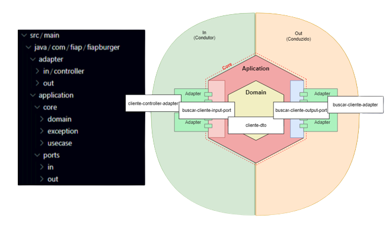

# Tecnologias

Visando robustez, adaptabilidade e alinhamento com o expertise da equipe, optamos pelas seguintes tecnologias

## Arquitetura: Hexagonal

A arquitetura hexagonal, ou "ports and adapters", promove a separação da lógica de negócios de dispositivos de entrada/saída. Ela aumenta a manutenibilidade, facilita testes e permite flexibilidade na substituição de tecnologias externas.

## Linguagem: Java 17

Java é uma linguagem de programação orientada a objetos, conhecida por sua portabilidade e robustez. Amplamente adotada, é usada em aplicações web, móveis e sistemas empresariais. Possui uma vasta biblioteca padrão e é suportada por uma grande comunidade.

## Banco de dados: PostgreSQL 

O PostgreSQL é um sistema de gerenciamento de banco de dados relacional de código aberto. Conhecido pela robustez e extensibilidade, é uma opção popular para aplicações de larga escala. Suporta extensões como JSON, GIS e permite personalização com funções definidas pelo usuário.

## Distribuicao: Docker

O Docker é uma plataforma de contêineres que facilita a criação, implantação e execução de aplicações. Ele garante consistência entre ambientes, simplifica a escalabilidade e aumenta a eficiência através do isolamento de recursos.
